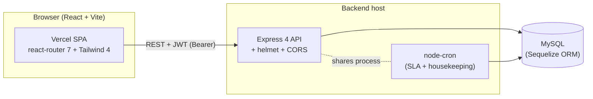
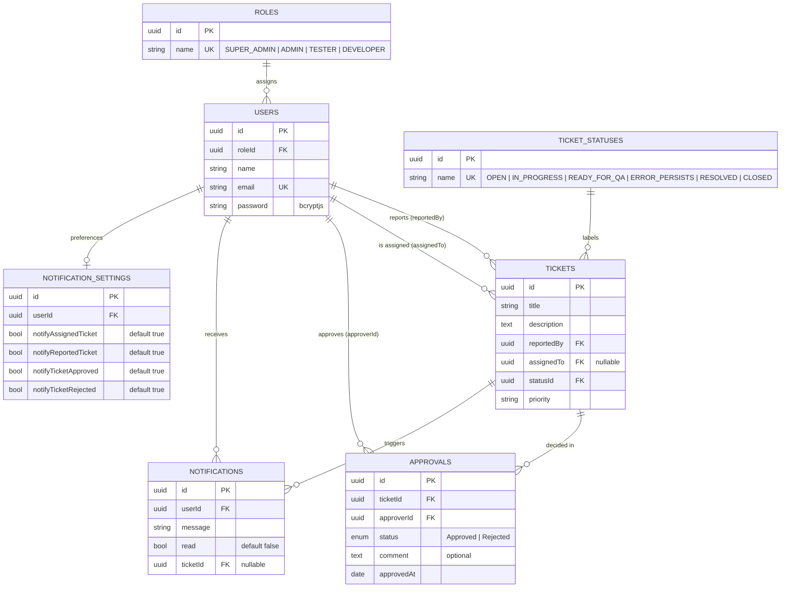
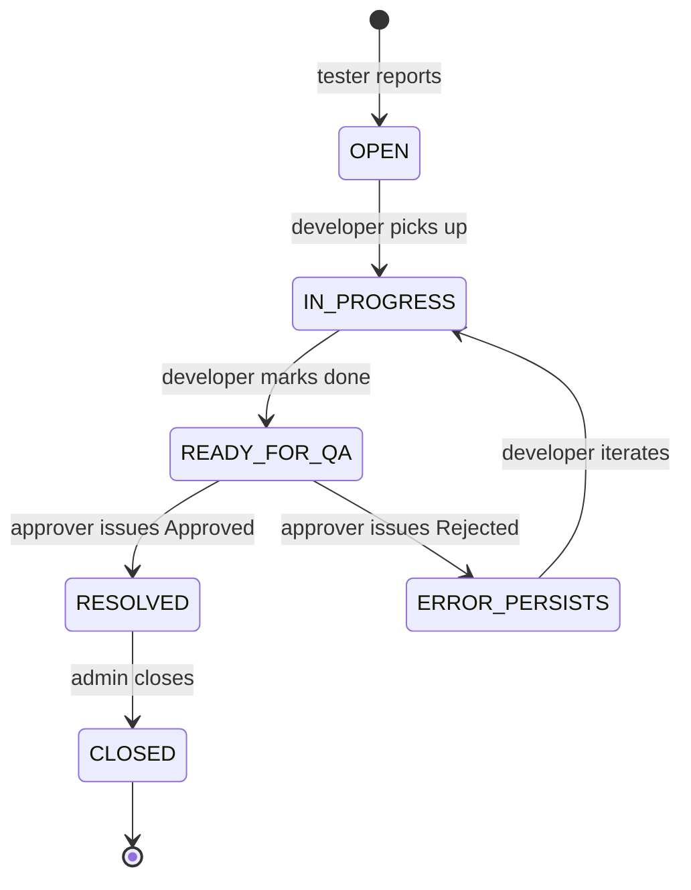

# Service Ticket System

> Internal IT/QA ticketing platform with a built-in approval workflow — testers report defects, developers fix them, admins triage, and approvers sign them off before tickets close.

The system spans **two repositories**:

| Repository | What it is | Stack |
|---|---|---|
| [`service-ticket-system`](https://github.com/Asciente-rks/service-ticket-system) | REST API backend | Express 4 + Sequelize + MySQL + node-cron |
| [`service-ticket-system-frontend`](https://github.com/Asciente-rks/service-ticket-system-frontend) | Web client (SPA) | React 19 + Vite + Tailwind 4 |

🌐 **Live demo:** [service-ticket-system-frontend.vercel.app](https://service-ticket-system-frontend.vercel.app)

> **You're reading the README in one of those repos.** The same overview lives in both — scroll to [Local Development](#local-development) for setup specific to this repo.

---

## Table of Contents

1. [What It Does](#what-it-does)
2. [System Architecture](#system-architecture)
3. [Tech Stack](#tech-stack)
4. [Repository Layout](#repository-layout)
5. [Database Design](#database-design)
6. [Roles & Permissions](#roles--permissions)
7. [Ticket Lifecycle](#ticket-lifecycle)
8. [Notifications](#notifications)
9. [API Reference](#api-reference)
10. [Deployment](#deployment)
11. [Local Development](#local-development)
12. [Environment Variables](#environment-variables)

---

## What It Does

- **Report tickets** with title, description, priority, optional initial assignment.
- **Assign and re-assign** tickets between developers and admins.
- **Track six statuses** through the lifecycle: `OPEN → IN_PROGRESS → READY_FOR_QA → ERROR_PERSISTS / RESOLVED → CLOSED`.
- **Approval workflow** — once a ticket is `READY_FOR_QA`, an approver issues `Approved` (with an optional comment) to move it to `RESOLVED`, or `Rejected` to bounce it back to `IN_PROGRESS`/`ERROR_PERSISTS`.
- **In-app notifications** with a per-user read flag and granular toggles for which events should fire notifications.
- **Profile + settings** pages let users update their account and notification preferences.
- **Role-scoped UI** — admins see user management, testers see their reported tickets, developers see assignments, super-admins see everything.
- **Cron-driven housekeeping** — scheduled jobs run on the backend (`initCronJobs`) for SLA reminders / stale-ticket processing.

---

## System Architecture



The backend is a single Express service: `helmet` for headers, `cors`, `express.json()`, route mounts at `/auth`, `/users`, `/tickets`, `/notifications`, plus a `/health` liveness probe. On startup, `connectDB()` opens the Sequelize connection, `defineAssociations()` wires Sequelize relations, and `initCronJobs()` schedules background tasks. Everything shares the same Node process — no queue, no worker.

---

## Tech Stack

### Backend (`service-ticket-system`)

| Concern | Choice |
|---|---|
| Language | **TypeScript 5** |
| HTTP framework | **Express 4** |
| Security | **helmet** + **cors** |
| ORM | **Sequelize 6** |
| Database | **MySQL** (`mysql2` driver) |
| Auth | **JWT** (`jsonwebtoken`) + **bcryptjs** |
| Validation | **yup** |
| Scheduled jobs | **node-cron** |
| Dev | nodemon (`ts-node` watch) |
| Bootstrap | `postinstall` runs `npm run build`, plus seed scripts (`db:sync`, `seed:roles`, `seed:status`, `seed:users`, `db:reset`) |

### Frontend (`service-ticket-system-frontend`)

| Concern | Choice |
|---|---|
| Language | **TypeScript 5**, React **19** |
| Build | **Vite 8** |
| Styling | **Tailwind CSS 4** + custom theme provider |
| Routing | **react-router-dom 7** |
| HTTP | **axios** |
| Auth | **jwt-decode** (parse JWT client-side) |
| Icons | **lucide-react** |
| Lint | **ESLint 9** + typescript-eslint |
| Hosting | **Vercel** |

---

## Repository Layout

### Backend

```
service-ticket-system/
├── package.json                      # build, db:sync, seed:roles/status/users, db:reset
├── tsconfig.json
└── src/
    ├── server.ts                     # Express bootstrap + route mounts + cron init
    ├── associations/
    │   └── associations.ts           # All Sequelize relations in one place
    ├── config/
    │   ├── db.ts                     # Sequelize connection
    │   ├── roles.ts                  # Hardcoded role UUIDs
    │   └── statuses.ts               # Hardcoded ticket-status UUIDs
    ├── middlewares/
    │   ├── auth.middleware.ts        # JWT verification
    │   ├── permissions.middleware.ts # Per-route permission gates
    │   ├── role.utils.ts
    │   └── validator.middleware.ts   # yup schema runner
    ├── modules/
    │   ├── tickets/                  # Modular: controllers, services,
    │   │   │                         # repositories, dtos, models, routes, cron
    │   │   ├── controllers/  …       # create, get, list, update, fetch-status,
    │   │   │                         # approval
    │   │   ├── services/     …       # ticket.service.ts (10KB), approval.service.ts
    │   │   ├── repositories/  …
    │   │   ├── dtos/  …
    │   │   ├── models/   …           # ticket, ticket-status, approval
    │   │   ├── routes/   …
    │   │   └── cron/ticket.cron.ts   # SLA / stale-ticket housekeeping
    │   ├── users/                    # Same modular pattern for users + auth
    │   │   ├── controllers/   …      # auth (login), CRUD, role fetching,
    │   │   │                         # notification settings
    │   │   ├── services/   …         # auth.service, user.service,
    │   │   │                         # notification-setting.service
    │   │   ├── repositories/  …
    │   │   ├── dtos/  …
    │   │   ├── models/  …            # user, role, notification-settings
    │   │   └── routes/  …            # auth.routes, user.routes,
    │   │                             # notification-settings.routes
    │   └── notifications/            # Listing + creation
    │       ├── controllers/list-notifications.controller.ts
    │       ├── services/notification.service.ts
    │       ├── repositories/notification.repository.ts
    │       ├── dtos/  …
    │       ├── models/notification.model.ts
    │       └── routes/notification.routes.ts
    ├── scripts/
    │   ├── sync-db.ts                # sequelize.sync() helper
    │   ├── seed-roles.ts
    │   ├── seed-ticket-status.ts
    │   └── seed-users.ts
    └── utils/
        ├── notification.validation.ts
        ├── ticket.validation.ts
        └── user.validation.ts
```

### Frontend

```
service-ticket-system-frontend/
├── package.json                       # React 19, Vite 8, Tailwind 4
├── eslint.config.js
├── vite.config.ts
├── vercel.json
├── tsconfig*.json                    # split app/node configs
├── public/
│   ├── favicon.svg
│   └── icons.svg                     # SVG sprite sheet
├── index.html
└── src/
    ├── App.tsx                       # Routes wrapped with ThemeProvider
    ├── main.tsx
    ├── index.css                     # Tailwind + tokens
    ├── theme.tsx                     # ThemeProvider (dark/light)
    ├── assets/                       # Logo variants
    ├── components/
    │   ├── Layout.tsx                # Top bar + side nav shell
    │   ├── ProtectedRoute.tsx
    │   ├── Settings.tsx              # In-app settings panel
    │   ├── CreateTicketModal.tsx     # ~16KB
    │   ├── EditTicketModal.tsx       # ~16KB
    │   ├── TicketDetailModal.tsx
    │   ├── ApprovalModal.tsx
    │   ├── CreateUserModal.tsx
    │   └── EditUserModal.tsx
    ├── pages/
    │   ├── Login.tsx
    │   ├── Dashboard.tsx             # Big page, ~25KB — lists + filters + actions
    │   ├── UserManagement.tsx
    │   ├── NotificationsPage.tsx
    │   └── ProfilePage.tsx
    ├── services/api.ts               # axios instance + interceptors
    ├── types/index.ts
    └── utils/
        ├── auth.ts
        └── labelStyles.tsx           # Status / priority pill styling
```

---

## Database Design

Seven Sequelize models. All primary keys are UUID v4. DB columns are **snake_case** (`reported_by`, `assigned_to`, `status_id`); model attributes are camelCase, mapped via Sequelize `field`.



### Notable design choices

- **Roles and statuses are referenced by UUID, not enum.** The repo ships with **hardcoded UUIDs** in `src/config/roles.ts` and `src/config/statuses.ts` so seeders and code agree:
  ```typescript
  // Roles
  SUPER_ADMIN: 'c3b538f5-8c72-48e2-b268-6a1359a62fe7'
  ADMIN:       '0927eb32-25c8-4819-bddd-c8e9c6c1dfaf'
  TESTER:      'bbf4184d-92c3-4a90-bbb2-de33c6c38a29'
  DEVELOPER:   '668f4898-47ae-4da3-a1a5-fe8eb34a7f82'

  // Ticket statuses
  OPEN, IN_PROGRESS, READY_FOR_QA,
  ERROR_PERSISTS, RESOLVED, CLOSED
  ```
- **Two FKs from `tickets` to `users`** — one for the reporter and one for the assignee, with named Sequelize aliases (`reporter` / `assignee`).
- **`approvals` is a per-decision audit row**, not a state column on `tickets`. Multiple approvals over a ticket's lifetime are preserved.
- **`notification_settings` is 1:1 with users.** Every notification-emitting action checks the recipient's settings before writing a row.
- **`bcryptjs` instead of `bcrypt`** — no native build step on platforms like Render or Vercel serverless functions.

---

## Roles & Permissions

| Role | Can report | Can assign | Can update | Can approve/reject | Can manage users |
|---|---|---|---|---|---|
| **SUPER_ADMIN** | ✓ | ✓ | ✓ | ✓ | ✓ |
| **ADMIN** | ✓ | ✓ | ✓ | ✓ | ✓ |
| **DEVELOPER** | ✓ | ✗ | own assigned only | ✗ | ✗ |
| **TESTER** | ✓ | ✗ | own reported (reopen) | ✓ (QA sign-off on reported tickets) | ✗ |

Permissions are enforced in `src/middlewares/permissions.middleware.ts`, which is mounted per route on top of `auth.middleware.ts` (which validates the JWT and hydrates `req.user`).

---

## Ticket Lifecycle



`Approval` rows are created on the `READY_FOR_QA → RESOLVED` and `READY_FOR_QA → ERROR_PERSISTS` transitions. The `comment` field on an Approval becomes part of the ticket's audit trail.

The `ticket.cron.ts` job runs on a configurable schedule and is responsible for SLA-style housekeeping (e.g. nudging stale tickets); customize the schedule in `initCronJobs()`.

---

## Notifications

Each notification-emitting event respects the recipient's `NotificationSettings` row before a row is written:

| Event | Setting that gates it |
|---|---|
| Ticket assigned to me | `notifyAssignedTicket` |
| Ticket I reported was updated | `notifyReportedTicket` |
| My ticket was approved | `notifyTicketApproved` |
| My ticket was rejected | `notifyTicketRejected` |

A defaults row (all `true`) is auto-created for new users. Users tweak preferences from the settings panel; the API exposes `GET /users/notification-settings` and `PUT /users/notification-settings`. Listings are paginated; mark-as-read is per-row.

---

## API Reference

| Prefix | Auth | Surface |
|---|---|---|
| `GET /health` | none | `{ status: "UP", service, timestamp }` |
| `/auth` | none for `/login` | `POST /login` → JWT |
| `/users` | JWT | CRUD users, fetch role list, manage **own** notification-settings |
| `/tickets` | JWT | Create / list / get / update tickets, **approval** sub-routes (`/tickets/:id/approve`, `/reject`), status fetching |
| `/notifications` | JWT | List own notifications |

The frontend's `src/services/api.ts` is a thin axios wrapper that injects the JWT and points at `VITE_API_URL`.

---

## Deployment

### Backend

The backend is host-agnostic — it's a stock Express + MySQL + Sequelize service. Recommended hosts:

- **Render Web Service** (Node) — connect the repo, set environment variables, point at MySQL.
- **AWS Elastic Beanstalk / EC2 / ECS** — same Node deployment story.
- **Railway** / **Fly.io** — straightforward.

The `postinstall` script runs `npm run build` so production deploys compile TypeScript automatically. Bootstrap the database once with `npm run db:reset` (sync schema + seed roles/statuses/users), then run `npm start` to serve the compiled app from `dist/server.js`.

### Frontend → Vercel

```bash
cd service-ticket-system-frontend
npm install
npm run build      # → dist/
```

Vercel auto-detects Vite. SPA fallback routing is configured in `vercel.json`. Set `VITE_API_URL` in Vercel's project settings.

Live build: **[service-ticket-system-frontend.vercel.app](https://service-ticket-system-frontend.vercel.app)**.

---

## Local Development

### Backend

```bash
git clone https://github.com/Asciente-rks/service-ticket-system.git
cd service-ticket-system
npm install                # postinstall runs npm run build

# Start MySQL locally and create the database
# Then bootstrap the schema + seed reference data
npm run db:sync            # CREATE TABLEs via sequelize.sync()
npm run seed:roles         # 4 role rows with the hardcoded UUIDs
npm run seed:status        # 6 ticket-status rows with the hardcoded UUIDs
npm run seed:users         # Demo accounts
# Or do all four at once:
npm run db:reset

npm run dev                # nodemon → ts-node src/server.ts (port 3000 by default)
```

### Frontend

```bash
git clone https://github.com/Asciente-rks/service-ticket-system-frontend.git
cd service-ticket-system-frontend
npm install
npm run dev                # Vite on :5173 with HMR
npm run lint
npm run build && npm run preview
```

Set `VITE_API_URL=http://localhost:3000` in `.env.local` while pointing at the local backend.

---

## Environment Variables

### Backend (`.env`)

```env
NODE_ENV=development
PORT=3000
SERVICE_NAME=service-ticket-system

# MySQL (Sequelize)
DB_HOST=localhost
DB_PORT=3306
DB_NAME=service_tickets
DB_USER=root
DB_PASSWORD=...

# Auth
JWT_SECRET=...
JWT_EXPIRES_IN=7d
```

### Frontend (`.env.local`)

```env
VITE_API_URL=http://localhost:3000   # or your deployed backend URL
```

---

## Author

Built by [Asciente-rks](https://github.com/Asciente-rks). Demo at **[service-ticket-system-frontend.vercel.app](https://service-ticket-system-frontend.vercel.app)**.
