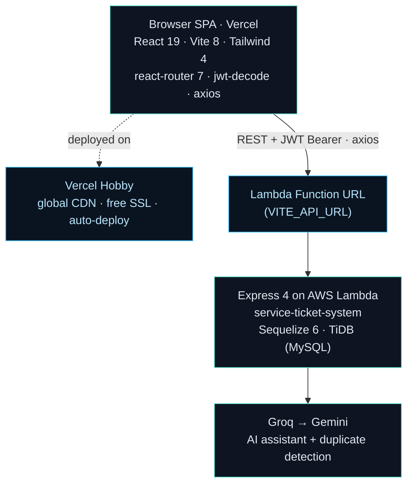
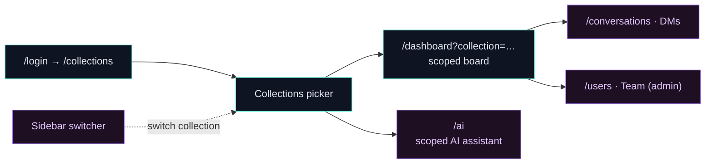
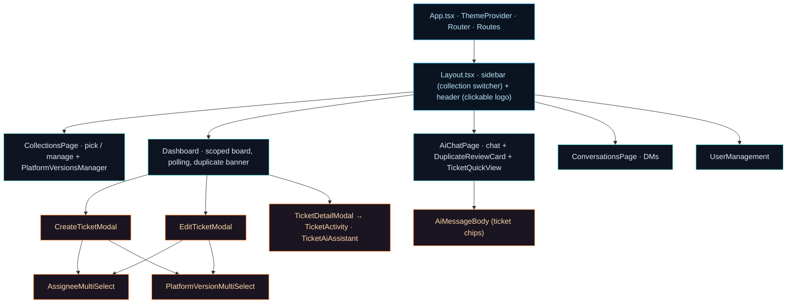

# NexusTrack — Frontend (service-ticket-system-frontend)

> Multi-tenant QA/defect tracking SPA. Pick a **Collection** (project space), then triage a six-status ticket workflow with **multiple assignees**, **per-collection platform/version tagging**, threaded discussion, teammate DMs, and a built-in **AI assistant** (conversational queries + duplicate review) — all near-real-time. Built on React 19 + Vite 8 + Tailwind 4, deployed free on Vercel.

This is the **web client** for NexusTrack. The companion REST API (Express 4 on AWS Lambda + TiDB Cloud) lives in [`service-ticket-system`](https://github.com/Asciente-rks/service-ticket-system).

---

## Live Demo

- **Live app:** https://service-ticket-system-frontend.vercel.app/login
- **Backend:** AWS Lambda (Function URL), consumed via `axios` using `VITE_API_URL`.
- **Try it:** use the demo accounts on the login page (Admin / Developer / Tester quick-login), or register a new account and create your own organization.

---

## Table of Contents

1. [What It Does](#what-it-does)
2. [Architecture](#architecture)
3. [Navigation Model — Collections first](#navigation-model--collections-first)
4. [Routing Map](#routing-map)
5. [Component Tree](#component-tree)
6. [State, Auth & Real-time](#state-auth--real-time)
7. [Tech Stack](#tech-stack)
8. [Repository Layout](#repository-layout)
9. [Deployment & Environment Variables](#deployment--environment-variables)
10. [Cost Breakdown](#cost-breakdown)
11. [Local Development](#local-development)
12. [Repos](#repos)
13. [Author](#author)

---

## What It Does

- **Email-OTP onboarding** — register → verify code → set password, then create an organization or join one via invite code (`Register`, `ForgotPassword`, `Onboarding`).
- **Collections as the workspace gate** — after login the user lands on the Collections picker; choosing one scopes the dashboard, the AI assistant, and the platform/version catalog. A collection switcher lives in the sidebar header.
- **Per-collection dashboard** — KPI cards, filter/sort, an AI **duplicate-detection banner**, and ticket cards showing status, priority, assignees and platform/version.
- **Multiple assignees** — a searchable multi-select (`AssigneeMultiSelect`) with chips and a "primary" badge, on both create and edit.
- **Platform/version tagging** — a searchable multi-select (`PlatformVersionMultiSelect`) drawn from the collection's catalog; admins manage the catalog from the Collections page (`PlatformVersionsManager`).
- **Six-status lifecycle + approvals** — role-gated status transitions; approvers approve/reject with an audit comment (`ApprovalModal`).
- **Threaded discussion + timeline** — nested comments and an activity timeline that poll for near-real-time updates (`TicketActivity`).
- **In-ticket AI + AI chat** — ask the assistant about one ticket (`TicketAiAssistant`), or use the full AI chat page for org/collection-wide questions and **duplicate review**. Ticket links open in an overlay (`TicketQuickView`) so you never leave the conversation.
- **Direct messaging** — 1:1 teammate conversations that poll for new messages (`ConversationsPage`, `DmMessageBody`).
- **Near-real-time** — the dashboard refetches on an interval + window focus and reconciles the open ticket after any change, so create/edit/delete show up within seconds without a manual refresh.
- **Dark / light theme**, role-aware nav, and production bundle hardening (no source maps, content-hash filenames, neutered `console.*` / React DevTools hook via `utils/security.ts`).

---

## Architecture


```mermaid
flowchart TB
    Browser["Browser SPA · Vercel<br/>React 19 · Vite 8 · Tailwind 4<br/>react-router 7 · jwt-decode · axios"]
    Vercel["Vercel Hobby<br/>global CDN · free SSL · auto-deploy"]
    URL["Lambda Function URL<br/>(VITE_API_URL)"]
    API["Express 4 on AWS Lambda<br/>service-ticket-system<br/>Sequelize 6 · TiDB (MySQL)"]
    AI["Groq → Gemini<br/>AI assistant + duplicate detection"]

    Browser -->|REST + JWT Bearer · axios| URL
    URL --> API
    API --> AI
    Browser -.deployed on.-> Vercel

    classDef edge fill:#0f1422,stroke:#5eead4,color:#e2e8f0
    classDef host fill:#0a1420,stroke:#38bdf8,color:#bae6fd
    class Browser,API,AI edge
    class Vercel,URL host
```

### Notable choices

- **Single axios instance + interceptor** (`services/api.ts`) — injects the JWT from `localStorage` on every request; on `401` it clears the session and routes to `/login`, and on `403 { code: "NO_ORGANIZATION" }` it routes to `/onboarding`.
- **Client-side role awareness** — `jwt-decode` reads role/org from the token (`utils/auth.ts`); nav items and actions render accordingly, but the server is always the source of truth.
- **Modal-centric UX** — most work happens in modals (`CreateTicketModal`, `EditTicketModal`, `TicketDetailModal`, `ApprovalModal`, `TicketQuickView`, `PlatformVersionsManager`) portalled over the active page.
- **Reusable ticket overlay** — `TicketQuickView` fetches a ticket and renders its full detail (with edit/approve/delete) as an overlay, so opening a ticket from the AI chat never navigates away.
- **Near-real-time via polling** — no websockets; the dashboard, ticket activity, and DM pages poll on short intervals + window focus, and list responses are served `no-store`.

---

## Navigation Model — Collections first


```mermaid
flowchart LR
    login["/login → /collections"] --> pick["Collections picker"]
    pick --> dash["/dashboard?collection=…<br/>scoped board"]
    pick --> ai["/ai<br/>scoped AI assistant"]
    sidebar["Sidebar switcher"] -.switch collection.-> pick
    dash --> conv["/conversations · DMs"]
    dash --> team["/users · Team (admin)"]

    classDef tier fill:#0f1422,stroke:#5eead4,color:#e2e8f0
    classDef flow fill:#1f0f22,stroke:#a978ff,color:#e2c8ff
    class login,pick,dash tier
    class ai,sidebar,conv,team flow
```

Collections are the high-level workspace: removed from the sidebar nav as a peer item and promoted to the post-login gate plus a sidebar-header switcher. Everything inside (dashboard, AI chats, platform/version catalog) is scoped to the active collection.

---

## Routing Map

| Path | Component | Guard | Notes |
|------|-----------|-------|-------|
| `/login` `/register` `/forgot-password` | `Login` / `Register` / `ForgotPassword` | public | Email-OTP onboarding |
| `/onboarding` | `Onboarding` | auth (no org) | Create or join an organization |
| `/collections` | `CollectionsPage` | auth + org | Post-login gate + admin catalog management |
| `/dashboard` | `Dashboard` | auth + org | Per-collection board (`?collection=`) |
| `/ai` | `AiChatPage` | auth + org | Conversational assistant + duplicate review |
| `/conversations` | `ConversationsPage` | auth + org | Teammate DMs |
| `/users` | `UserManagement` | auth + org (admin) | Team management |
| `/notifications` | `NotificationsPage` | auth + org | Notification center |
| `/profile` `/settings` | `ProfilePage` / `Settings` | auth + org | Self-service |

All protected routes are wrapped by `ProtectedRoute` (synchronous JWT check) inside `Layout`, under a top-level `ThemeProvider` + `BrowserRouter` (`App.tsx`).

---

## Component Tree


```mermaid
flowchart TB
    App["App.tsx · ThemeProvider · Router · Routes"]
    App --> Layout["Layout.tsx · sidebar (collection switcher) + header (clickable logo)"]
    Layout --> Collections["CollectionsPage · pick / manage + PlatformVersionsManager"]
    Layout --> Dash["Dashboard · scoped board, polling, duplicate banner"]
    Layout --> Ai["AiChatPage · chat + DuplicateReviewCard + TicketQuickView"]
    Layout --> Conv["ConversationsPage · DMs"]
    Layout --> Team["UserManagement"]

    Dash --> CT["CreateTicketModal"]
    Dash --> ET["EditTicketModal"]
    Dash --> TD["TicketDetailModal → TicketActivity · TicketAiAssistant"]
    CT --> AMS["AssigneeMultiSelect"]
    CT --> PVM["PlatformVersionMultiSelect"]
    ET --> AMS
    ET --> PVM
    Ai --> AMB["AiMessageBody (ticket chips)"]

    classDef shell fill:#0a1420,stroke:#38bdf8,color:#bae6fd
    classDef page fill:#0f1422,stroke:#5eead4,color:#e2e8f0
    classDef modal fill:#1a1520,stroke:#f97316,color:#fed7aa
    class App,Layout shell
    class Collections,Dash,Ai,Conv,Team page
    class CT,ET,TD,AMS,PVM,AMB modal
```

---

## State, Auth & Real-time

- **Auth** — JWT in `localStorage`, decoded by `utils/auth.ts`; `ProtectedRoute` guards routes; the axios interceptor handles `401`/`403` redirects.
- **Active collection** — persisted in `localStorage` (`activeCollection`) and read from the `?collection=` param; it scopes the dashboard and the AI assistant.
- **Real-time** — `Dashboard` polls `/tickets` (+ `/collections`) every few seconds and on window focus, refetches immediately after mutations, and reconciles the open `TicketDetailModal`; `TicketActivity` and `ConversationsPage` poll comments / messages on short cycles.

---

## Tech Stack

| Layer | Technology |
|-------|-----------|
| Framework | React 19 + TypeScript 5 |
| Build | Vite 8 (content-hash output, source maps off in prod) |
| Styling | Tailwind CSS 4 + `ThemeProvider` (dark/light tokens) |
| Routing | react-router-dom 7 |
| HTTP | axios + request/response interceptors |
| Auth | jwt-decode |
| Icons | lucide-react |
| Lint | ESLint 9 + typescript-eslint |
| Hosting | Vercel Hobby (auto-deploy on push, global CDN, free SSL) |

---

## Repository Layout

```
service-ticket-system-frontend/
└── src/
    ├── App.tsx                     # ThemeProvider · Router · Routes · ProtectedRoute
    ├── theme.tsx                   # dark/light context
    ├── services/api.ts             # axios instance + JWT interceptor + 401/403 routing
    ├── pages/
    │   ├── Login · Register · ForgotPassword · Onboarding
    │   ├── CollectionsPage         # post-login gate + platform/version manager entry
    │   ├── Dashboard               # scoped board, polling, duplicate banner
    │   ├── AiChatPage              # AI assistant + duplicate review + ticket overlay
    │   ├── ConversationsPage       # teammate DMs
    │   ├── UserManagement · NotificationsPage · ProfilePage
    ├── components/
    │   ├── Layout · ProtectedRoute · Settings · ConfirmDialog
    │   ├── CreateTicketModal · EditTicketModal · TicketDetailModal · ApprovalModal
    │   ├── AssigneeMultiSelect · PlatformVersionMultiSelect · PlatformVersionsManager
    │   ├── TicketQuickView · TicketActivity · TicketAiAssistant
    │   ├── AiMessageBody · DuplicateReviewCard · DmMessageBody
    │   ├── CreateUserModal · EditUserModal · ChangePasswordModal · PasswordConfirmModal · AuthShell
    ├── types/index.ts              # shared types (Ticket, Collection, PlatformVersion, AI…)
    └── utils/                      # auth · apiError · labelStyles · security
```

---

## Deployment & Environment Variables

Vercel auto-detects Vite and deploys on every push to `main`; `vercel.json` provides the SPA fallback so client routes survive a hard refresh.

| Variable | Where | Purpose |
|----------|-------|---------|
| `VITE_API_URL` | Vercel project settings | Base URL for axios — the backend's **Lambda Function URL** |

```env
# .env.local for local development
VITE_API_URL=http://localhost:3000
```

---

## Cost Breakdown

**$0/month** — the SPA is fully static on a free tier.

| Service | Free tier | We use | Headroom |
|---------|-----------|--------|----------|
| Vercel Hobby | 100 GB bandwidth, unlimited deploys | < 500 MB/mo | 99.5% |
| GitHub (public repo) | unlimited | storage only | unlimited |

---

## Local Development

```bash
git clone https://github.com/Asciente-rks/service-ticket-system-frontend.git
cd service-ticket-system-frontend
npm install
npm run dev           # Vite HMR at :5173 (point VITE_API_URL at the backend)
npm run lint
npm run build         # production bundle → dist/
npm run preview
```

---

## Repos

| Repo | Stack | Link |
|------|-------|------|
| **service-ticket-system-frontend** (this repo) | React 19 + Vite 8 + Tailwind 4 | https://github.com/Asciente-rks/service-ticket-system-frontend |
| **service-ticket-system** | Express 4 + Sequelize 6 + TiDB (MySQL) on AWS Lambda | https://github.com/Asciente-rks/service-ticket-system |

---

## Author

**Ralph Kenneth Sonio** — [Portfolio](https://asciente-portfolio.vercel.app) · [GitHub](https://github.com/Asciente-rks)
