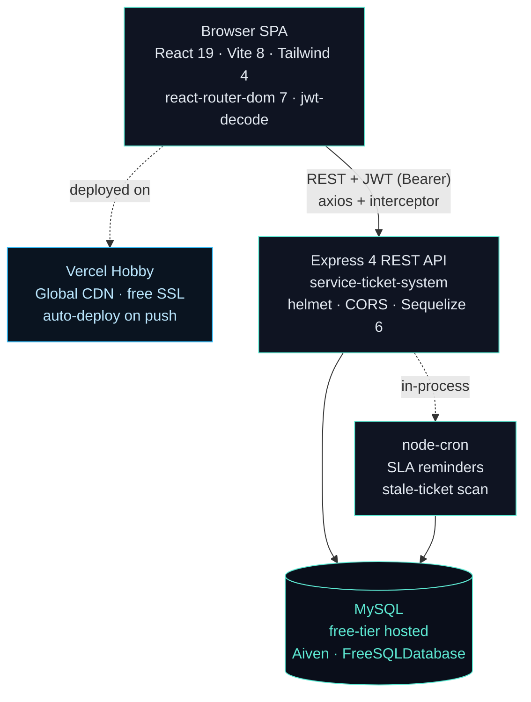
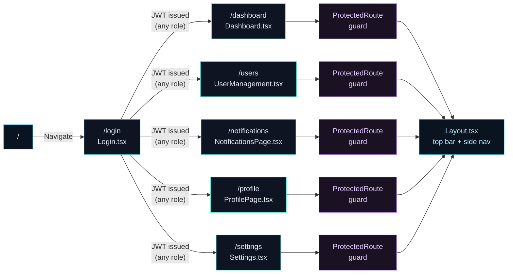
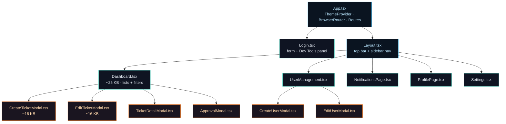
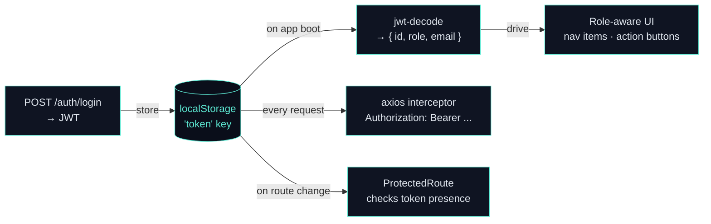
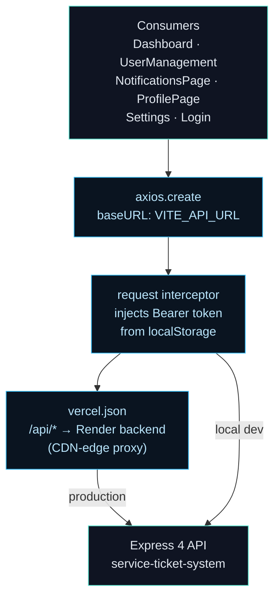
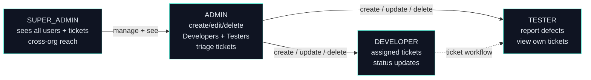
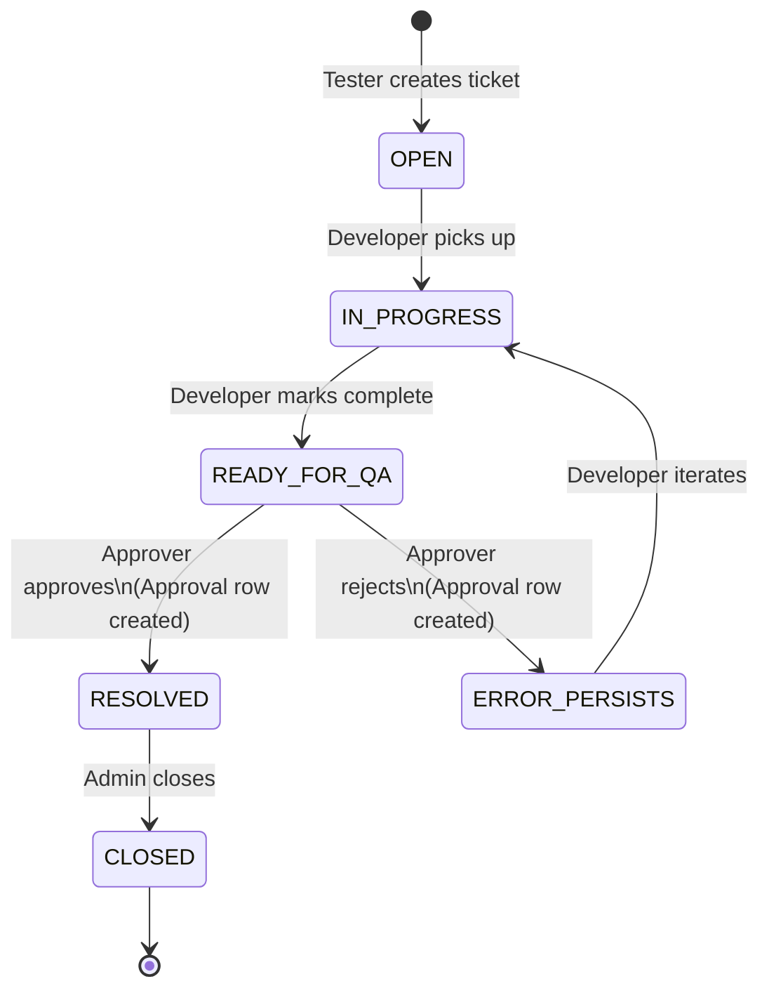

# Service Ticket System — Frontend

> Internal IT/QA ticketing SPA — testers report defects, developers fix them, admins triage, and approvers sign off before tickets close. Built on React 19 + Vite 8 + Tailwind 4, deployed on Vercel at no cost.

This repository is the **web client** half of the Service Ticket System. It is a single-page application that drives a four-role ticket workflow (`SUPER_ADMIN`, `ADMIN`, `TESTER`, `DEVELOPER`) with six lifecycle statuses, per-ticket approval/rejection, granular per-user notification settings, and role-scoped views. The companion REST API lives in [`service-ticket-system`](https://github.com/Asciente-rks/service-ticket-system).

---

## Live Demo

- **Live app:** https://service-ticket-system-frontend.vercel.app/login
- **Backend:** Render Web Service (`service-ticket-system-backend.onrender.com`)
- **Try the Dev Tools panel:** click the floating wrench button on the login page for one-click sign-in as Admin, Developer, or Tester.

> The Render backend may take 10–15 seconds to wake on the first request (free-tier cold start). Subsequent requests are warm.

---

## Table of Contents

1. [What It Does](#what-it-does)
2. [Architecture](#architecture)
3. [Routing Map](#routing-map)
4. [Component Tree](#component-tree)
5. [State & Auth](#state--auth)
6. [API Client](#api-client)
7. [Role Hierarchy](#role-hierarchy)
8. [Ticket Lifecycle](#ticket-lifecycle)
9. [Tech Stack](#tech-stack)
10. [Repository Layout](#repository-layout)
11. [Deployment & Environment Variables](#deployment--environment-variables)
12. [Cost Breakdown](#cost-breakdown)
13. [Local Development](#local-development)
14. [Repos](#repos)
15. [Author](#author)

---

## What It Does

- **Submit tickets** with title, description, priority (`LOW / MEDIUM / HIGH / CRITICAL`), and optional initial assignee.
- **Six-status lifecycle** — `OPEN → IN_PROGRESS → READY_FOR_QA → RESOLVED / ERROR_PERSISTS → CLOSED` — with role-gated transitions enforced client-side and server-side.
- **Approval workflow** — once a ticket reaches `READY_FOR_QA`, an approver issues `Approved` (with optional comment) to advance to `RESOLVED`, or `Rejected` to bounce back.
- **Role-scoped views** — the same `Dashboard.tsx` surface adapts based on the decoded JWT: super-admins see all tickets and users, admins triage and assign, testers see only what they reported, developers see their assignments.
- **In-app notifications** — real-time-style panel with per-message read state; per-user toggles for which events fire (`notify_assigned_ticket`, `notify_ticket_approved`, `notify_ticket_rejected`, `notify_reported_ticket_updated`).
- **User management** — admins and higher can create / edit / delete users; role hierarchy is enforced (admins cannot see or alter other admins / superadmin).
- **Dark / light theme** — `ThemeProvider` in `theme.tsx` injects CSS tokens; toggled from the settings panel.
- **Bundle hardening** — production builds disable source maps, use content-hash filenames, replace `console.*` with no-ops, and disable the React DevTools global hook via `src/utils/security.ts`.
- **Dev Tools quick-login** — floating panel on `/login` prefills and submits the real `/auth/login` endpoint as Admin, Developer, or Tester — no typing required for portfolio reviewers.

---

## Architecture


```mermaid
flowchart TB
    Browser["Browser SPA\nReact 19 · Vite 8 · Tailwind 4\nreact-router-dom 7 · jwt-decode"]
    Vercel["Vercel Hobby\nGlobal CDN · free SSL\nauto-deploy on push"]
    Express["Express 4 REST API\nservice-ticket-system\nhelmet · CORS · Sequelize 6"]
    MySQL[("MySQL\nfree-tier hosted\nAiven · FreeSQLDatabase")]
    Cron["node-cron\nSLA reminders\nstale-ticket scan"]

    Browser -->|"REST + JWT (Bearer)\naxios + interceptor"| Express
    Browser -.deployed on.-> Vercel
    Express --> MySQL
    Express -.in-process.-> Cron
    Cron --> MySQL

    classDef edge fill:#0f1422,stroke:#5eead4,color:#e2e8f0
    classDef store fill:#0a0e1a,stroke:#5eead4,color:#5eead4
    classDef host fill:#0a1420,stroke:#38bdf8,color:#bae6fd
    class Browser,Express,Cron edge
    class MySQL store
    class Vercel host
```

### Notable architectural choices

- **Axios instance with a request interceptor** (`src/services/api.ts`) — a single `axios.create({ baseURL: VITE_API_URL })` instance auto-injects the JWT from `localStorage` on every outbound request. No per-call auth plumbing anywhere in the codebase.
- **`jwt-decode` for client-side role awareness** — the raw JWT is decoded in `src/utils/auth.ts` to extract the role string. No second network round-trip needed to decide which nav items and actions to render.
- **`ThemeProvider`** wraps the entire tree in `App.tsx` before the router, so every component can read the theme context without prop drilling.
- **Modal-centric UX** — heavy lifting happens in `CreateTicketModal`, `EditTicketModal`, `TicketDetailModal`, and `ApprovalModal` rather than in separate routes. The `Dashboard` page renders the list and portals the active modal.
- **`ProtectedRoute`** — thin wrapper that reads the decoded token from localStorage; if absent or expired, redirects to `/login`. No server round-trip on navigation.
- **`vercel.json` proxy + SPA fallback** — `/api/*` is reverse-proxied to the Render backend URL at the CDN edge (eliminates CORS on cross-origin XHR during production). All other paths fall back to `/index.html` for client-side routing.

---

## Routing Map


```mermaid
flowchart LR
    Root["/"] -->|Navigate| Login["/login\nLogin.tsx"]

    Login -->|"JWT issued\n(any role)"| Dashboard["/dashboard\nDashboard.tsx"]
    Login -->|"JWT issued\n(any role)"| Users["/users\nUserManagement.tsx"]
    Login -->|"JWT issued\n(any role)"| Notifs["/notifications\nNotificationsPage.tsx"]
    Login -->|"JWT issued\n(any role)"| Profile["/profile\nProfilePage.tsx"]
    Login -->|"JWT issued\n(any role)"| Settings["/settings\nSettings.tsx"]

    Dashboard --> PR1["ProtectedRoute\nguard"]
    Users --> PR2["ProtectedRoute\nguard"]
    Notifs --> PR3["ProtectedRoute\nguard"]
    Profile --> PR4["ProtectedRoute\nguard"]
    Settings --> PR5["ProtectedRoute\nguard"]

    PR1 & PR2 & PR3 & PR4 & PR5 --> Layout["Layout.tsx\ntop bar + side nav"]

    classDef page fill:#0f1422,stroke:#5eead4,color:#e2e8f0
    classDef guard fill:#1a1222,stroke:#a978ff,color:#e2c8ff
    classDef shell fill:#0a1420,stroke:#38bdf8,color:#bae6fd
    class Login,Dashboard,Users,Notifs,Profile,Settings page
    class PR1,PR2,PR3,PR4,PR5 guard
    class Layout,Root shell
```

All protected routes are wrapped in `<ThemeProvider><Router>` at the top level (`App.tsx`). `ProtectedRoute` checks for a valid JWT in localStorage synchronously; missing or expired tokens redirect to `/login` before the target component mounts.

---

## Component Tree


```mermaid
flowchart TB
    App["App.tsx\nThemeProvider · BrowserRouter · Routes"]

    App --> LoginPage["Login.tsx\nform + Dev Tools panel"]
    App --> LayoutShell["Layout.tsx\ntop bar + sidebar nav"]

    LayoutShell --> DashPage["Dashboard.tsx\n~25 KB · lists + filters"]
    LayoutShell --> UsersPage["UserManagement.tsx"]
    LayoutShell --> NotifsPage["NotificationsPage.tsx"]
    LayoutShell --> ProfilePage["ProfilePage.tsx"]
    LayoutShell --> SettingsComp["Settings.tsx"]

    DashPage --> CTModal["CreateTicketModal.tsx\n~16 KB"]
    DashPage --> ETModal["EditTicketModal.tsx\n~16 KB"]
    DashPage --> TDModal["TicketDetailModal.tsx"]
    DashPage --> AModal["ApprovalModal.tsx"]

    UsersPage --> CUModal["CreateUserModal.tsx"]
    UsersPage --> EUModal["EditUserModal.tsx"]

    classDef page fill:#0f1422,stroke:#5eead4,color:#e2e8f0
    classDef modal fill:#1a1520,stroke:#f97316,color:#fed7aa
    classDef shell fill:#0a1420,stroke:#38bdf8,color:#bae6fd
    class LoginPage,DashPage,UsersPage,NotifsPage,ProfilePage,SettingsComp page
    class CTModal,ETModal,TDModal,AModal,CUModal,EUModal modal
    class App,LayoutShell shell
```

The `Dashboard.tsx` page is the most complex surface (~25 KB). It renders a filterable ticket list and conditionally portals one of four modals depending on the current user action. All modals receive a callback to refresh the list on save.

---

## State & Auth


```mermaid
flowchart LR
    Login["POST /auth/login\n→ JWT"]
    LS[("localStorage\n'token' key")]
    Decode["jwt-decode\n→ { id, role, email }"]
    Interceptor["axios interceptor\nAuthorization: Bearer ..."]
    PR["ProtectedRoute\nchecks token presence"]
    UI["Role-aware UI\nnav items · action buttons"]

    Login -->|store| LS
    LS -->|on app boot| Decode
    Decode -->|drive| UI
    LS -->|every request| Interceptor
    LS -->|on route change| PR

    classDef store fill:#0a0e1a,stroke:#5eead4,color:#5eead4
    classDef action fill:#0f1422,stroke:#5eead4,color:#e2e8f0
    class LS store
    class Login,Decode,Interceptor,PR,UI action
```

There is no Redux or React Context for auth state. The JWT is stored in `localStorage` and read by:

- `src/utils/auth.ts` — decodes the token and exposes role/id/email
- `src/services/api.ts` — injects the token via axios interceptor
- `src/components/ProtectedRoute.tsx` — guards every protected route
- `Layout.tsx` — reads the role to show/hide nav items (e.g., User Management is admin+ only)

Session ends by clearing `localStorage` and navigating to `/login`.

---

## API Client


```mermaid
flowchart TB
    Config["axios.create\nbaseURL: VITE_API_URL"]
    Interceptor["request interceptor\ninjects Bearer token\nfrom localStorage"]
    Proxy["vercel.json\n/api/* → Render backend\n(CDN-edge proxy)"]

    Endpoints["Consumers\nDashboard · UserManagement\nNotificationsPage · ProfilePage\nSettings · Login"]

    Config --> Interceptor
    Interceptor --> Proxy
    Proxy -->|"production"| Backend["Express 4 API\nservice-ticket-system"]
    Interceptor -->|"local dev"| Backend

    Endpoints --> Config

    classDef infra fill:#0a1420,stroke:#38bdf8,color:#bae6fd
    classDef logic fill:#0f1422,stroke:#5eead4,color:#e2e8f0
    classDef store fill:#0a0e1a,stroke:#5eead4,color:#5eead4
    class Config,Interceptor,Proxy infra
    class Endpoints,Backend logic
```

`src/services/api.ts` is a thin module — ~10 lines:

```ts
import axios from "axios";

const api = axios.create({ baseURL: import.meta.env.VITE_API_URL });

api.interceptors.request.use((config) => {
  const token = localStorage.getItem("token");
  if (token) config.headers.Authorization = `Bearer ${token}`;
  return config;
});

export default api;
```

All pages import `api` and call the relevant path directly (e.g., `api.post("/auth/login", body)`). No generated client, no SDK.

---

## Role Hierarchy


```mermaid
flowchart LR
    super["SUPER_ADMIN\nsees all users + tickets\ncross-org reach"]
    admin["ADMIN\ncreate/edit/delete\nDevelopers + Testers\ntriage tickets"]
    dev["DEVELOPER\nassigned tickets\nstatus updates"]
    tester["TESTER\nreport defects\nview own tickets"]

    super -->|"manage + see"| admin
    admin -->|"create / update / delete"| dev
    admin -->|"create / update / delete"| tester
    dev -.ticket workflow.-> tester

    classDef tier fill:#0f1422,stroke:#5eead4,color:#e2e8f0
    class super,admin,dev,tester tier
```

| Role | Created by | Sees in User Management | Ticket access |
|------|------------|------------------------|---------------|
| `SUPER_ADMIN` | Seed script | Everyone | All tickets |
| `ADMIN` | SuperAdmin or Admin | Developers + Testers only | All tickets — triage, assign, close |
| `DEVELOPER` | Admin or SuperAdmin | Own profile only | Assigned tickets |
| `TESTER` | Admin or SuperAdmin | Own profile only | Reported tickets |

Role hierarchy is enforced backend-side (`permissions.middleware.ts`, `role.utils.ts`). The SPA reads the decoded role from the JWT to conditionally render nav items and action buttons — it never trusts the client alone.

---

## Ticket Lifecycle


```mermaid
stateDiagram-v2
    [*] --> OPEN : Tester creates ticket
    OPEN --> IN_PROGRESS : Developer picks up
    IN_PROGRESS --> READY_FOR_QA : Developer marks complete
    READY_FOR_QA --> RESOLVED : Approver approves\n(Approval row created)
    READY_FOR_QA --> ERROR_PERSISTS : Approver rejects\n(Approval row created)
    ERROR_PERSISTS --> IN_PROGRESS : Developer iterates
    RESOLVED --> CLOSED : Admin closes
    CLOSED --> [*]
```

Approval rows are immutable audit records — multiple approvals over a ticket's lifetime are all preserved. The `comment` field on each `Approval` becomes part of the permanent audit trail visible in `TicketDetailModal`.

---

## Tech Stack

| Layer | Technology | Why |
|-------|-----------|-----|
| Framework | **React 19** + TypeScript 5 | Latest concurrent features, familiar ecosystem |
| Build | **Vite 8** | Sub-second HMR, content-hash output |
| Styling | **Tailwind CSS 4** + ThemeProvider | Latest engine, dark/light token system |
| Routing | **react-router-dom 7** | Latest API, nested layouts |
| HTTP | **axios** + request interceptor | JWT injection in one place; interceptors |
| Auth | **jwt-decode 4** | Parse JWT client-side for role-aware UI |
| Icons | **lucide-react** | Consistent, tree-shakable icon set |
| Lint | ESLint 9 + typescript-eslint | Modern flat config |
| Hosting | **Vercel Hobby** | Free CDN + SSL + auto-deploy + zero-config Vite detection |

---

## Repository Layout

```
service-ticket-system-frontend/
├── package.json                    # React 19, Vite 8, Tailwind 4
├── eslint.config.js
├── vite.config.ts                  # disables source maps in prod, content-hash filenames
├── vercel.json                     # /api/* proxy → Render backend; SPA fallback
├── tsconfig*.json                  # split app/node configs
├── public/
│   ├── favicon.svg
│   └── icons.svg                   # SVG sprite sheet
├── index.html
└── src/
    ├── App.tsx                     # ThemeProvider · BrowserRouter · Routes · ProtectedRoute
    ├── main.tsx
    ├── index.css                   # Tailwind directives + base tokens
    ├── theme.tsx                   # ThemeProvider (dark/light context)
    ├── assets/                     # Logo variants (dark, light, no-name)
    ├── components/
    │   ├── Layout.tsx              # Top bar + side nav shell (~15 KB)
    │   ├── ProtectedRoute.tsx      # JWT presence guard → /login redirect
    │   ├── Settings.tsx            # In-app settings panel
    │   ├── CreateTicketModal.tsx   # ~16 KB — full form + validation
    │   ├── EditTicketModal.tsx     # ~16 KB — status + assignee + priority
    │   ├── TicketDetailModal.tsx   # Read view + approval history
    │   ├── ApprovalModal.tsx       # Approve / Reject with comment
    │   ├── CreateUserModal.tsx
    │   └── EditUserModal.tsx
    ├── pages/
    │   ├── Login.tsx               # Form + Dev Tools quick-login panel
    │   ├── Dashboard.tsx           # ~25 KB — filterable list, modal portal
    │   ├── UserManagement.tsx      # Admin+ CRUD
    │   ├── NotificationsPage.tsx
    │   └── ProfilePage.tsx
    ├── services/
    │   └── api.ts                  # axios instance + JWT interceptor
    ├── types/
    │   └── index.ts                # Shared TypeScript types
    └── utils/
        ├── auth.ts                 # jwt-decode wrapper → role/id/email
        ├── labelStyles.tsx         # Status / priority pill Tailwind classes
        └── security.ts             # Prod: no-op console.*, disable React DevTools hook
```

---

## Deployment & Environment Variables

### Frontend — Vercel

```bash
# One-time setup in Vercel project settings:
# VITE_API_URL = https://service-ticket-system-backend.onrender.com

npm install
npm run build    # → dist/
```

Vercel auto-detects Vite. The `vercel.json` handles two things:

1. **`/api/*` proxy** — rewrites to the Render backend URL at the CDN edge, so axios calls `VITE_API_URL=/api` in production and avoids CORS.
2. **SPA fallback** — all other paths rewrite to `/index.html` so client-side routes (e.g. `/dashboard`) survive a hard refresh.

Assets under `/assets/*` are served with `Cache-Control: public, max-age=31536000, immutable` (one year) via content-hash filenames from Vite.

### Environment variables

| Variable | Where | Purpose |
|----------|-------|---------|
| `VITE_API_URL` | Vercel project settings | Base URL for the axios instance |

For local development, create `.env.local`:

```env
VITE_API_URL=http://localhost:3000
```

---

## Cost Breakdown

Designed for **$0/month forever** — the entire frontend stack runs on free tiers with no expiry.

| Service | Free tier | We use | Headroom |
|---------|-----------|--------|----------|
| Vercel Hobby (SPA) | 100 GB bandwidth, unlimited deploys | <500 MB/mo | 99.5% |
| GitHub (public repo) | Unlimited | Storage only | Unlimited |

**Monthly total: $0/month**

**Why Vercel for this SPA:**
- Zero-config Vite detection — `npm run build` output is deployed as-is.
- Global CDN + free SSL with no configuration.
- Automatic deploys on every push to `main`.
- Edge-level `/api/*` reverse proxy eliminates CORS without a dedicated middleware layer.

---

## Local Development

```bash
git clone https://github.com/Asciente-rks/service-ticket-system-frontend.git
cd service-ticket-system-frontend
npm install
npm run dev           # Vite HMR at :5173
npm run lint          # ESLint 9 + typescript-eslint
npm run build         # production bundle → dist/
npm run preview       # serve dist/ locally
```

Point `VITE_API_URL` at the local backend (`http://localhost:3000`) while running the companion service. See [`service-ticket-system`](https://github.com/Asciente-rks/service-ticket-system) for backend setup instructions.

---

## Repos

| Repository | What it is | Stack |
|------------|-----------|-------|
| [`service-ticket-system-frontend`](https://github.com/Asciente-rks/service-ticket-system-frontend) | Web client (this repo) | React 19 + Vite 8 + Tailwind 4 |
| [`service-ticket-system`](https://github.com/Asciente-rks/service-ticket-system) | REST API backend | Express 4 + Sequelize + MySQL + node-cron |

---

## Author

**Ralph Kenneth Sonio** — [Portfolio](https://asciente-portfolio.vercel.app) · [GitHub](https://github.com/Asciente-rks)
